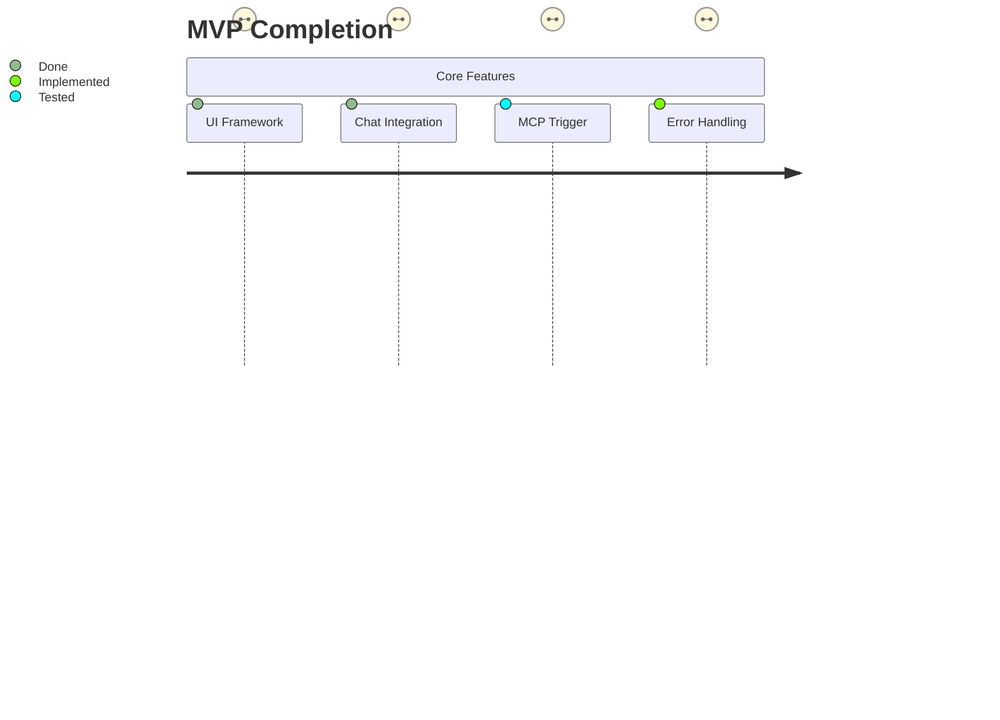

# Implementation Progress

## Current Status


## Pending Tasks
1. Finalize browser action result formatting
2. Implement animation performance optimizations
3. Add E2E test coverage for edge cases

## Known Issues
```typescript
interface KnownIssues {
  id: string;
  description: string;
  severity: 'low' | 'medium' | 'high';
}
const currentIssues: KnownIssues[] = [
  {
    id: 'ANIM-01',
    description: 'Minor frame drops during complex transitions',
    severity: 'low'
  }
];
```

## Roadmap
```mermaid
gantt
    title Development Timeline
    dateFormat  YYYY-MM-DD
    section MVP
    Final Testing       :active, 2025-02-13, 3d
    User Acceptance     :2025-02-16, 2d
    section Phase 2
    Auth Integration    :2025-02-20, 5d
    Performance Suite   :2025-02-25, 7d