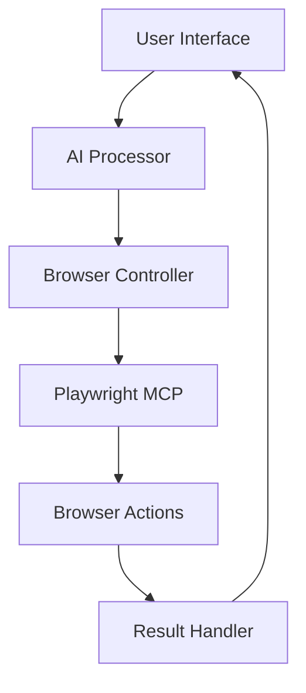
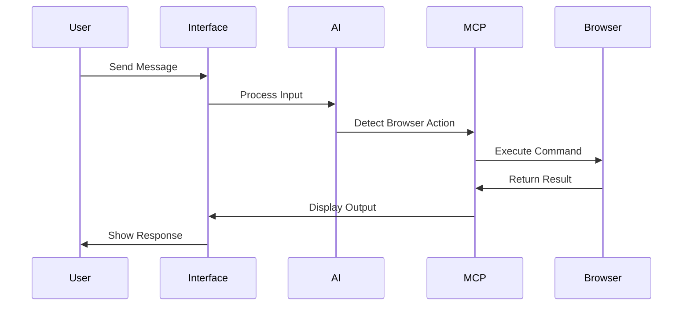
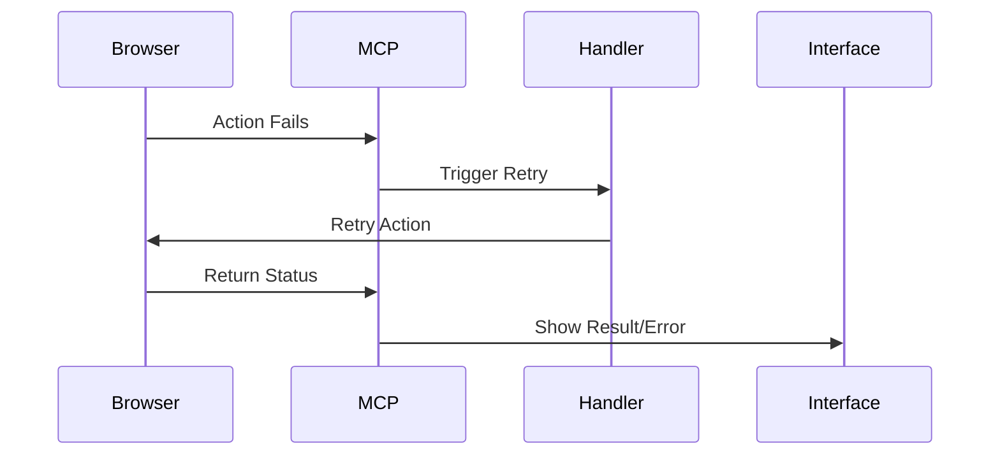

# System Architecture

## Component Communication Flow


## Message Processing Flow


## Error Handling Flow


## Component Integration
```mermaid
graph LR
    A[Next.js App] --> B[Simple AI]
    A --> C[shadcn/ui]
    A --> D[Tailwind]
    A --> E[Playwright MCP]
    E --> F[Browser]